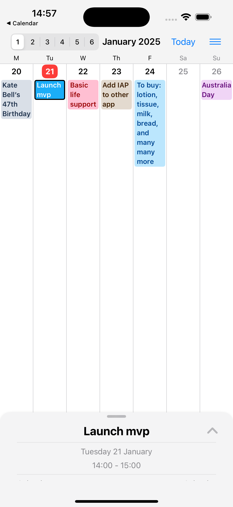
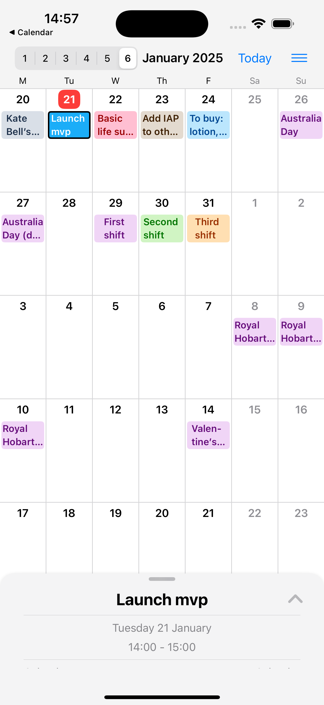

# big Cal: Calendar Viewer

big Cal (Big Calendar) is an iOS calendar app that designed to deliver better user experience for viewing calendar events.
Currently, this is the bare minimum MVP version of the app, with plans for further enhancements as the concept is validated and user demand grows.

## Features

- layout: adjust the monthly calendar view with the flexibility to show varying number of weeks
- events: events are displayed in full or multiple lines depending on the layout
- navigation: event details are not in a separate screen, keeping use to focus on one screen

## Screenshots

  
  

## Privacy Policy

[Privacy Policy](privacy-policy.md)

## Support

Email the developer at gimbapapps@gmail.com for any inquiries or to share your feedback.

## How to support the App ❤️

- Share your feedback by emailing the developer
- Give 5 stars on the App Store
- Buy me a digital coffee [[buy](https://buymeacoffee.com/minhokim)]
- Tip the developer: [[tip](https://buy.stripe.com/9AQg1ph2x6CJ2be9AA)]
