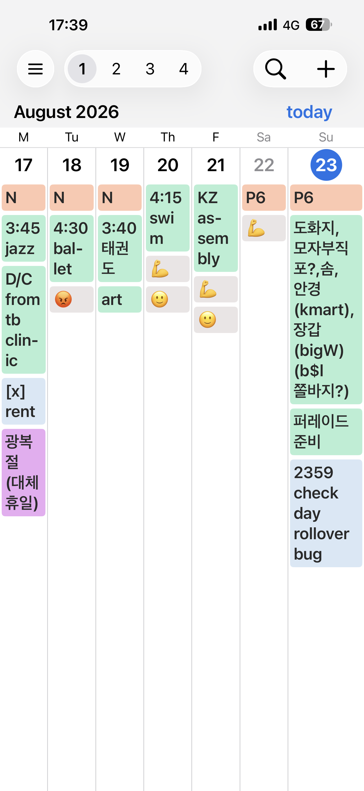
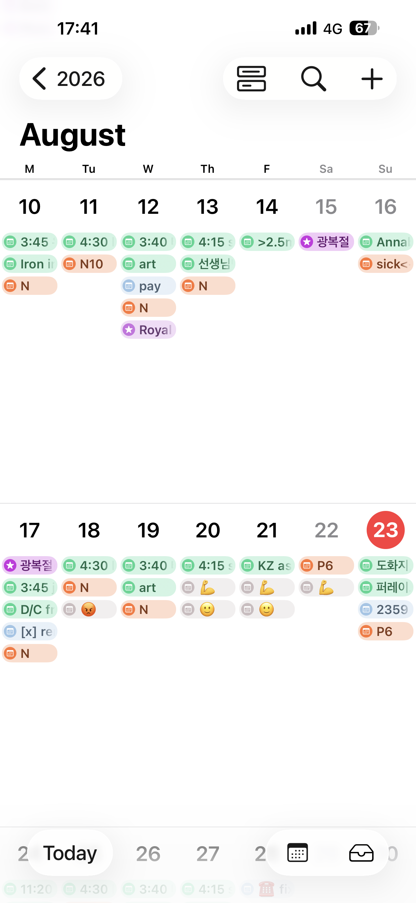
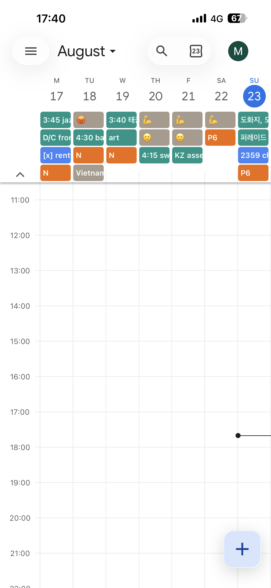

# Big Calendar

A big, easy-to-see calendar for iPhone.

Big Calendar shows the calendars already on your device — iCloud, Google, and
anything else synced through iOS — in a large, high-contrast layout that's easy
to read at a glance.

## Features

- **Big, clear layout** — your events shown large and easy to read.
- **Choose how many weeks to see** — view 1–2 weeks for free, or up to 4 weeks
  with a one-time Pro upgrade.
- **Word replacements** — shorten long words in event titles (e.g. `birthday ->
  bday`, `movie -> 🍿`) so more fits on screen.
- **Pick which calendars show** — turn calendars on/off and reorder them so the
  ones you care about appear first each day.
- **Australian holidays by state** — if you subscribe to the Australian Holidays
  calendar, show only the states you care about.

## How events are ordered

Multi-day events always come first — they're drawn as bars at the top of each day.
Your calendar order from **Settings → calendars** then applies to the remaining
single-day events. So the calendar order isn't followed 100%: multi-day events take
priority over it.

## How event titles fit

How much of a long event title is shown depends on how many weeks you're viewing,
so more weeks still stay readable:

- **1–2 weeks:** titles wrap fully — no line limit.
- **3–4 weeks:** tighter tiles — the top week shows up to 2 lines, every week
  below shows 1 line.

When a title doesn't fit, it's clipped at the edge of the tile (no trailing "…"),
matching Apple and Google Calendar. This layout is a design choice and may change.
(In code it's controlled by `getLineLimit(weekRow:)` in `ViewModel.swift`.)

## Reminders

Reminders (from the iOS Reminders app) are not shown — Big Calendar displays
calendar events only.

## Pro

Big Calendar is free to use with a 1–2 week view. A single one-time purchase
unlocks the multi-week (3–4 week) view and any future Pro features. No
subscriptions.

## Using with Google Calendar

Big Calendar shows the calendars already on your iPhone, so add your Google account to iOS first:

1. **Settings -> Apps -> Calendar -> Calendar Accounts -> Add Account -> Google**, and sign in.
2. Turn on the **Calendars** toggle.

Then open Big Calendar — your events appear. If the grid is empty, no account has been added yet (step 1).

**For timely updates:** Google calendars only refresh on a schedule, so if new events are slow to show, set **Settings -> Apps -> Calendar -> Calendar Accounts -> Fetch New Data -> Every 15 Minutes**.

## Screenshot Comparison

| Apple Calendar | Google Calendar | Big Calendar |
| :------------: | :-------------: | :----------: |
|  |  |  |

## Privacy

Big Calendar does not collect, store, or share any of your information. Your
calendar events are read on your device only, to display them — they never leave
your phone and are never sent to us or anyone else.

See the [Privacy Policy](privacy-policy.md) for details.

## Support

Email: minho42+bigcalendar@gmail.com

